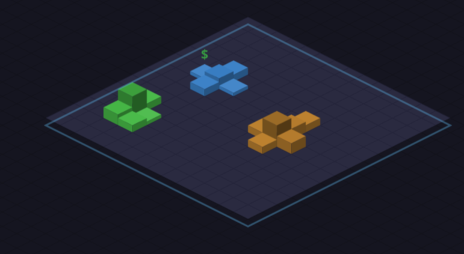

# Citidle - an idle, ambient city builder

## Play the game
https://nickrsan.github.io/Citidle

## Background
This is a project I've had in my head for a while, and I decided
to use it as a way to experiment with LLM agents. Most coding is being
done by Junie, the JetBrains agent (mostly backed by Gemini, but occasionally
other models), but I'm also diving in directly to make changes so I can stay familiar
with the code and learn how it is handling game development, which isn't an area
I have worked in.

## Inspiration
I've wanted a good, idle city builder for a while and have been considering
concepts for how it would play. I thought it'd be nice for it to have a solid
progression, but not one that constantly requires your attention - that also means
it can be the kind of visualization that could also sit in the background as a screensaver.

The city growth mechanics are inspired by Conway's Game of Life, while the rest
is inspired by specific games.

* City Builder: All of them, but using an isometric style similar to SimCity 2000.
* Idle: The two I've most enjoyed are SpacePlan (which has an ending!) and Egg Inc (which *really* doesn't end). While Egg Inc has some trappings, especially earlier on, you can also progress in the game by walking away for a long time. That's a mechanic I'd like to preserve
* Ambient: Colors, simplicity, and hopefully at some point sounds inspired by games like Osmos (colors), Eufloria (game feel/sound), Auralux (color, sound), and Mini Metro (game feel, sound)

I have much more I'm planning to add to this, but for now, it's available for fun and demo.